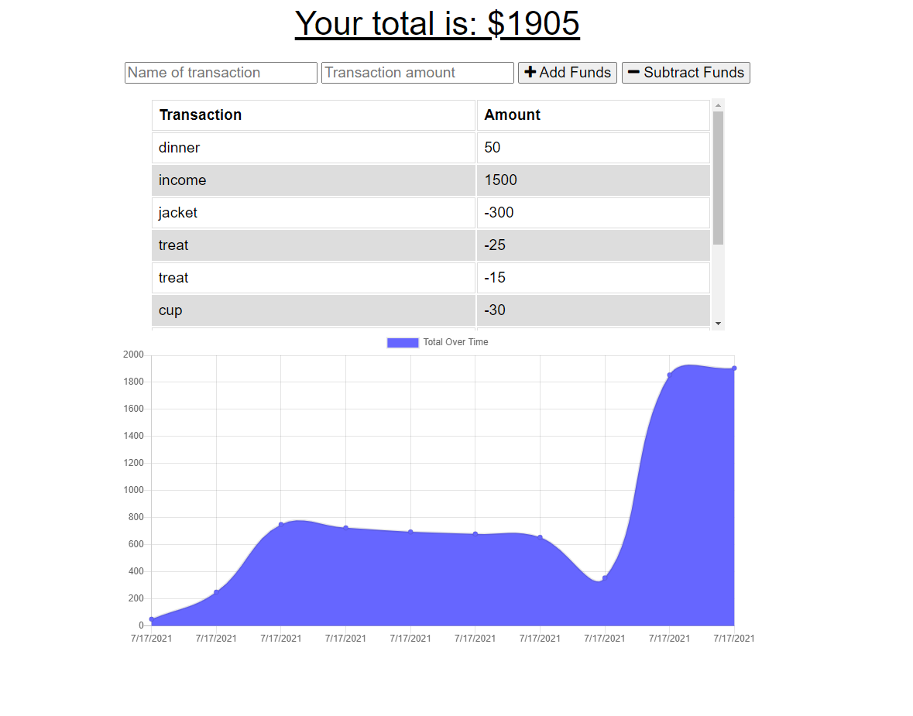
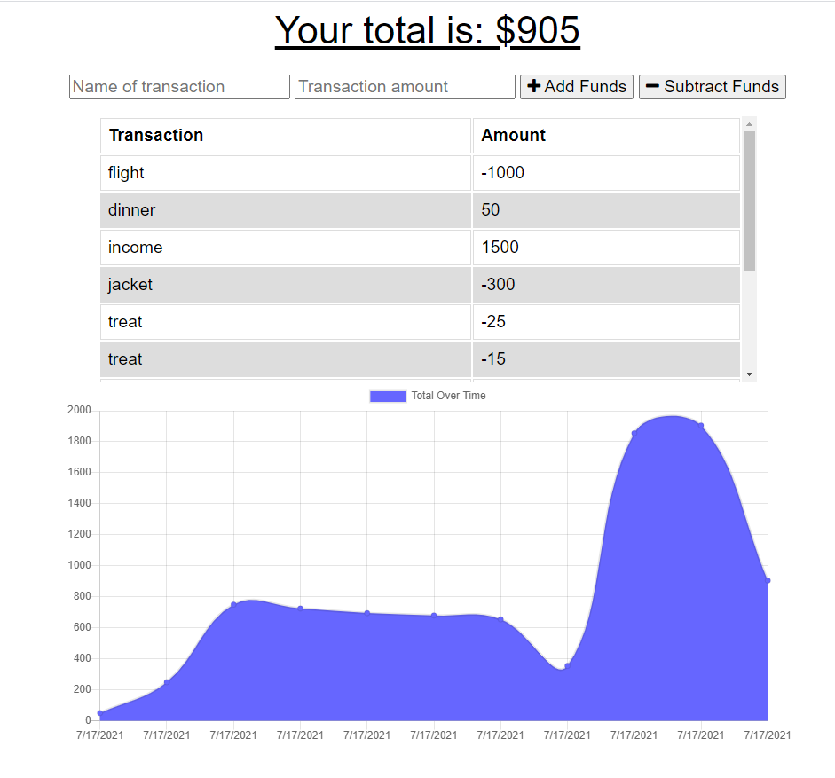

# Budget-tracker

[](https://opensource.org/licenses/MIT)

## Description

This application has been created as a budget tracker, allowing user to create and track daily income and expenses. Users are able to log transactions or income on a given day, whether or not they are connected to the internet or not. This is especially useful for when users are travelling. Users can input the name of the transaction, the transaction amount and add or subract these inputs. A chart is there to show the user their spending habits over time.

MongoDB has been used for the database and the application has been deployed on Heroku.

Link to the Heroku application for "Budget Tracker": [view app](https://shelby-budget-tracker.herokuapp.com/).

## Table of Contents

- [Installation](#installation)
- [Usage](#usage)
- [License](#license)
- [Contributing](#contributing)
- [Credits](#credits)
- [Tests](#tests)
- [Questions](#questions)

## Installation

Clone these files from the GitHub repository via your preferred means. Then make sure to install necessary dependencies by running the following commands:

```
npm init
```

```
npm install
```

## Usage

Once the files have been pull down to your preferred repository, run this application by inputting 'npm start' into your bash terminal. The server will start. You can then view the application in the default browser.




## License

This project is licensed by the [MIT](https://opensource.org/licenses/MIT) license

## Contributing

If this project is of interest to you, please contact me with a detailed description of how you would like to contribute prior to any pull requests.

## Credits

https://developer.mozilla.org/en-US/docs/Web/API/Service_Worker_API/Using_Service_Workers

## Tests

There are currently no tests for this application.

## Questions

If you have any questions or require further clarification then please contact me at:

- https://github.com/Shelbyrp/
- shelby.pignat@gmail.com
